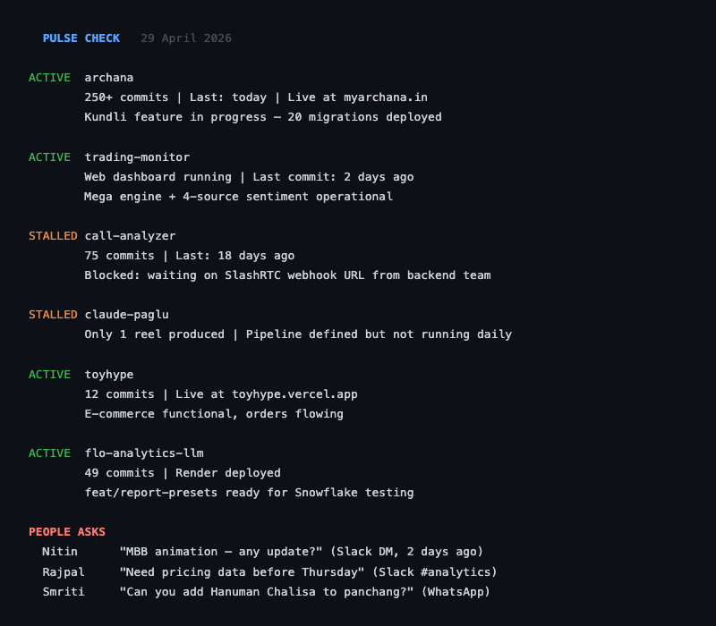
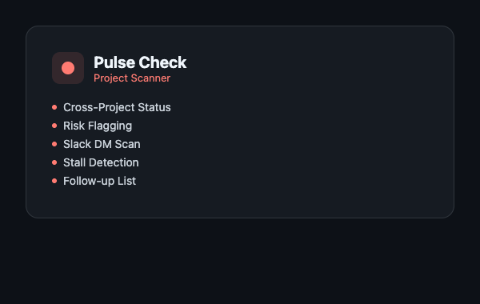

# Pulse Check

**Cross-project status scanner that flags what needs your attention.**

<p align="center">
  
</p>

<p align="center">
  
</p>

## What It Does

Pulse Check scans every active project in your workspace and gives you a single, honest status report. It pulls data from git logs, memory files, Gmail, and Slack -- then classifies everything as on track, at risk, or stalled. It also surfaces unanswered asks from colleagues hiding in your DMs. One command, full situational awareness.

## How It Works

1. You type `/pulse-check` or say "how are things going"
2. The skill runs five data-gathering passes in parallel across all tracked projects:
   - **Memory files** -- reads project status files for last known state and pending items
   - **Git logs** -- runs `git log --oneline --since="7 days ago"` in each project directory
   - **Gmail** -- searches for project-related threads from the last 7 days
   - **Slack (project keywords)** -- scans channels for project mentions
   - **Slack (people asks)** -- searches DMs and mentions for unanswered requests from colleagues
3. Each project is classified: **Active** (commits in last 7 days), **Stalled** (no commits in 7+ days), or **Blocked** (known blocker)
4. Follow-ups are sorted into three tiers: high priority (at risk), medium priority, and looking good
5. Output includes a "People Asks" section for colleague requests that are not tied to any specific project but still need a response
6. A one-sentence bottom line gives the honest overall assessment

## Key Features

- **Multi-source intelligence:** Combines git, email, Slack, and memory files -- not just one signal
- **People asks detection:** Surfaces DMs and mentions where colleagues asked for data, reviews, or decisions that you have not responded to
- **Risk classification:** Every item gets a status tag (IN PROGRESS, STALLED, DONE, BLOCKED, TO DO) so you see problems immediately
- **Days-until-end-of-month awareness:** Adds urgency context when deadlines are approaching
- **Graceful degradation:** If Gmail or Slack MCP is unavailable, it continues with git and memory data and notes the gap
- **No codebase scanning:** Only reads git logs, memory files, and external sources -- stays fast

## Usage

```
/pulse-check
```

**Trigger phrases:** "pulse check", "pulse", "project status", "how are things going", "what needs attention", "run pulse check"

## Output Format

```
## Pulse Check -- April 29, 2026

*1 day until end of April. Here's where everything stands.*

**Project Name** -- ACTIVE
- Feature X -- IN PROGRESS
- Deployment -- DONE
- Last commit: Apr 28 -- "fix auth flow for edge case"

**Project Name** -- STALLED
- No commits in 12 days. Is this parked or forgotten?

---

### People Asks (unanswered or pending)

- **Priyanka** -- Asked for QR tracking data -- PENDING
  - Context: DM from Monday asking for conversion numbers
  - Action: Pull the report from Amplitude

---

### Follow-ups Needed

**High priority (at risk)**
- **Project X** -- Stalled for 14 days, blocking downstream work

**Looking good**
- **Project Y** -- On track, last commit 2 hours ago

> **Bottom line:** Two projects healthy, one stalled and needs a decision this week.
```

---

Built with [Claude Code](https://claude.ai/code) as a slash command skill.
