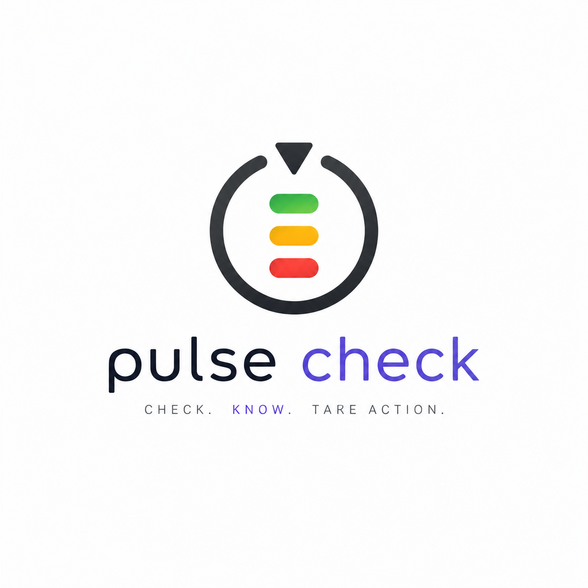
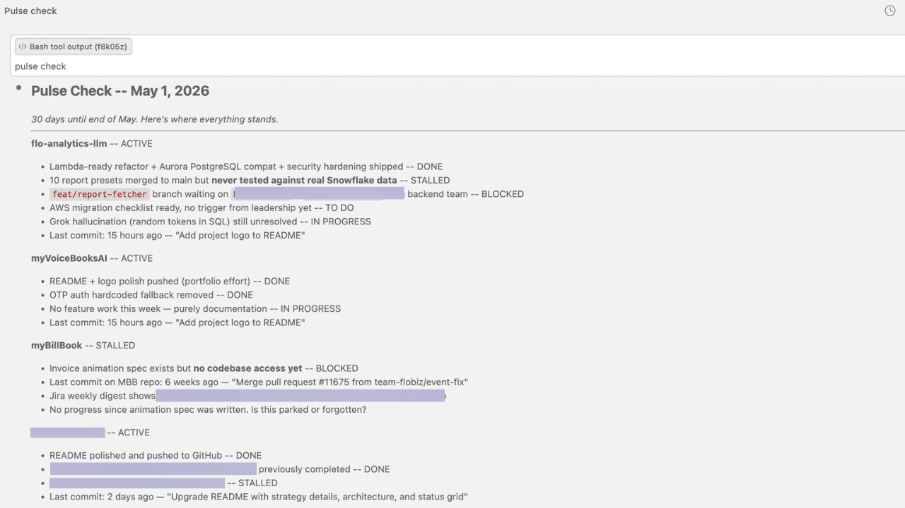
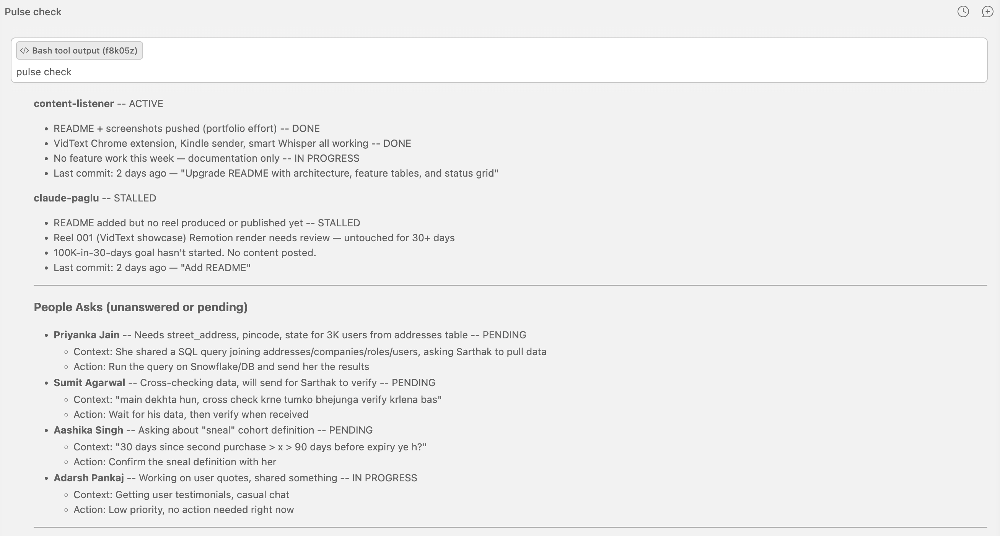
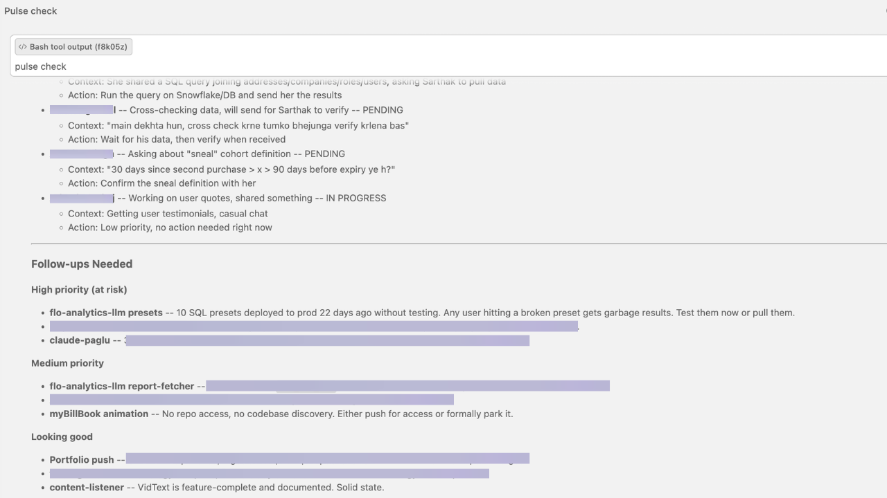

<p align="center">
  
</p>

# Pulse Check

**Cross-project status scanner that flags what needs your attention.**

<p align="center">
  
</p>

<p align="center">
  
</p>

<p align="center">
  
</p>

## Why

When you run 6+ projects simultaneously, things slip. A PR sits unreviewed for 12 days. A colleague asked for data in Slack and you forgot. A feature branch has not had a commit in 3 weeks. Pulse Check scans every active project across git, email, Slack, and memory files -- then gives you a single honest report: what is on track, what is at risk, and what is stalled. One command, full situational awareness.

## How

1. Type `/pulse-check` or say "how are things going" in Claude Code
2. Five data-gathering passes run in parallel across all tracked projects
3. Each project is classified: **Active** (commits in last 7 days), **Stalled** (no commits in 7+ days), or **Blocked** (known blocker)
4. Follow-ups are sorted into three risk tiers
5. A "People Asks" section surfaces colleague requests hiding in your Slack DMs
6. A one-sentence bottom line gives the honest overall assessment

```
/pulse-check
```

**Trigger phrases:** "pulse check", "pulse", "project status", "how are things going", "what needs attention"

## Features

| Category | Feature | Detail |
|----------|---------|--------|
| Git | 7-day activity scan | `git log --since="7 days ago"` per project, shows last commit |
| Gmail | Project email scan | Searches for project-related threads from last 7 days |
| Slack | Project mentions | Scans channels for project keyword mentions |
| Slack | People asks detection | Surfaces DMs where colleagues asked for data, reviews, or decisions you have not responded to |
| Memory | Last known state | Reads project memory files for pending items and blockers |
| Classification | Status tags | Every item tagged: ACTIVE, STALLED, DONE, BLOCKED, or TO DO |
| Classification | Risk tiers | Follow-ups sorted into high priority (at risk), medium, looking good |
| Context | End-of-month awareness | Adds urgency context when deadlines are approaching |
| Resilience | Graceful degradation | Continues with git + memory if Gmail or Slack MCP is unavailable |
| Performance | No codebase scanning | Only reads git logs, memory files, and external sources -- stays fast |

## Tech

| Component | Technology |
|-----------|------------|
| Runtime | Claude Code slash command skill |
| Git | Local `git log` commands per project directory |
| Email | Gmail MCP |
| Messaging | Slack MCP |
| Memory | `.claude/projects/` memory files (Markdown) |
| Projects | 6 active projects (configurable in SKILL.md) |

## Architecture

```
pulse-check/
├── SKILL.md                  # Skill definition: project list, data sources, output format
├── README.md                 # This file
├── logo.png                  # Skill icon
└── docs/
    ├── pulse-check-card.png       # Skill card screenshot
    └── pulse-check-output.png     # Sample output screenshot
```

The skill is a Claude Code agent definition that orchestrates git commands, Gmail MCP, and Slack MCP in parallel. No separate server or database -- it reads existing project state from memory files and git history, then produces a structured risk assessment.

## Output Format

```
## Pulse Check -- April 29, 2026

*1 day until end of April. Here's where everything stands.*

**Project Name** -- ACTIVE
- Feature X -- IN PROGRESS
- Last commit: Apr 28 -- "fix auth flow for edge case"

**Project Name** -- STALLED
- No commits in 12 days. Is this parked or forgotten?

---

### People Asks (unanswered or pending)

- **Priyanka** -- Asked for QR tracking data -- PENDING
  - Action: Pull the report from Amplitude

---

### Follow-ups Needed

**High priority (at risk)**
- **Project X** -- Stalled 14 days, blocking downstream work

**Looking good**
- **Project Y** -- On track, last commit 2 hours ago

> **Bottom line:** Two projects healthy, one stalled and needs a decision.
```

## Status

| Item | State |
|------|-------|
| Git activity scanning (6 projects) | Live |
| Gmail project thread search | Live |
| Slack project mention search | Live |
| Slack people-asks detection | Live |
| Memory file cross-reference | Live |
| Risk classification (3 tiers) | Live |
| End-of-month urgency awareness | Live |
| Graceful degradation | Live |

## Fork This

Use Pulse Check for your own projects in 3 steps:

### Prerequisites

- [Claude Code](https://claude.ai/code) installed
- Git repositories for the projects you want to track
- Optional MCP servers: [Gmail](https://github.com/anthropics/claude-code), [Slack](https://github.com/anthropics/claude-code) (works without them -- just scans git + memory)

### Install

```bash
# 1. Clone the repo
git clone https://github.com/sarthakgoel31/pulse-check.git

# 2. Copy the skill definition into Claude Code
mkdir -p ~/.claude/skills/pulse-check
cp pulse-check/SKILL.md ~/.claude/skills/pulse-check/SKILL.md

# 3. Verify it works
# In Claude Code, type: /pulse-check
```

### Customize

Open `SKILL.md` and replace the project list with your own:

```yaml
# Find this section in SKILL.md and swap in your projects:
projects:
  - name: "my-app"
    path: "/Users/you/projects/my-app"
  - name: "my-api"
    path: "/Users/you/projects/my-api"
```

Also adjust:
- **Gmail search keywords** -- add project names and teammate emails
- **Slack channels** -- point to your team's channels
- **Memory paths** -- point to your `.claude/projects/` directory

Without Gmail or Slack MCP, Pulse Check still works -- it scans git logs and memory files, giving you project health from commit activity alone.

---

Built by [Sarthak Goel](https://github.com/sarthakgoel31)
